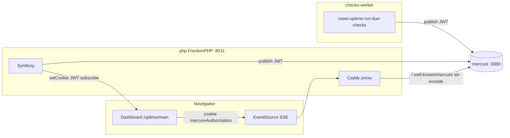

# Mercure en las demos (Symfony 7 y 8)

Las demos usan **`dashboard.sync: mercure`**: el dashboard recibe checks en tiempo real por **SSE** (Server-Sent Events), no por polling continuo al API.

## URLs

| Demo | Dashboard | Hub en el navegador (mismo origen) | Hub directo (solo debug) |
|------|-----------|--------------------------------------|---------------------------|
| Symfony 8 | http://localhost:8011/uptime/main | http://localhost:8011/.well-known/mercure | http://localhost:3080/.well-known/mercure |
| Symfony 7 | http://localhost:8010/uptime/main | http://localhost:8010/.well-known/mercure | http://localhost:3081/.well-known/mercure |

El navegador **siempre** debe usar el hub en el **mismo puerto que la app** (`8011` / `8010`). Así se envía la cookie JWT de suscripción. Si `MERCURE_PUBLIC_URL` apunta solo al puerto `3080`/`3081`, Mercure no recibe la cookie y verás solo refrescos manuales o fallback a polling.

## Arquitectura Docker



| Servicio | Rol |
|----------|-----|
| **php** | App web, proxy SSE hacia `mercure`, cookie JWT al cargar el dashboard |
| **checks-worker** | Bucle cada 15 s: ejecuta checks y **publica** en Mercure (`MERCURE_URL` interno) |
| **mercure** | Hub SSE; valida JWT de publisher y subscriber |

## Variables de entorno

En `demo/symfony8/.env` (o `.env.example`):

```env
MERCURE_URL=http://mercure/.well-known/mercure
MERCURE_PUBLIC_URL=http://localhost:8011/.well-known/mercure
MERCURE_JWT_SECRET=!ChangeThisMercureHubJWTSecretKey!
```

| Variable | Uso |
|----------|-----|
| `MERCURE_URL` | Symfony y el worker **publican** aquí (red Docker, hostname `mercure`) |
| `MERCURE_PUBLIC_URL` | URL que ve el **navegador** (proxy en FrankenPHP, mismo origen que la app) |
| `MERCURE_JWT_SECRET` | Clave compartida hub + `config/packages/mercure.yaml` |

Symfony 7: mismas variables con `PORT=8010` y hub público `http://localhost:8010/.well-known/mercure`.

## Configuración Symfony

`config/packages/nowo_uptime_monitor.yaml`:

```yaml
dashboard:
    sync: mercure
    poll_interval_ms: 30000   # solo si Mercure falla en el navegador
    mercure:
        topic_template: '/uptime/{tenant}'
        private: true
```

`config/packages/mercure.yaml`:

```yaml
mercure:
    hubs:
        default:
            url: '%env(MERCURE_URL)%'
            public_url: '%env(MERCURE_PUBLIC_URL)%'
            jwt:
                secret: '%env(MERCURE_JWT_SECRET)%'
                publish: ['*']
                subscribe: ['*']
```

## Seguridad (JWT, sin API key)

No hace falta configurar API keys en el front. El flujo es el estándar de **Symfony Mercure Bundle**:

1. **Publicar** (backend): el worker y Symfony usan `MERCURE_URL` + JWT (`publish`).
2. **Updates privados**: `mercure.private: true` en el bundle.
3. **Suscribir** (navegador): al abrir `/uptime/main`, Symfony llama a `Authorization::setCookie()` con el topic del tenant (p. ej. `/uptime/main`).
4. **EventSource** con `withCredentials: true` envía la cookie al hub (vía proxy en `:8011`).

En producción: cambia `MERCURE_JWT_SECRET`, usa HTTPS y restringe `publish` / `subscribe` en `mercure.yaml` (evita `*`).

## Proxy FrankenPHP (obligatorio en demo)

`docker/frankenphp/Caddyfile.dev` enruta `/.well-known/mercure` al contenedor `mercure` **sin** compresión `encode` (si no, SSE rompe con `ERR_INCOMPLETE_CHUNKED_ENCODING`):

```caddyfile
@mercure path /.well-known/mercure*
handle @mercure {
    reverse_proxy mercure:80 {
        flush_interval -1
        transport http {
            read_timeout 0
            write_timeout 0
        }
    }
}
```

Tras cambiar el Caddyfile:

```bash
docker compose restart php
```

## Comportamiento en el navegador

| Elemento | Qué indica |
|----------|------------|
| Badge **Mercure · connected** (verde) | SSE abierto |
| Badge **Mercure · connecting…** | Conectando |
| Badge **Polling · 30s** | Fallback: Mercure no disponible |
| Consola `📦 [uptime] script loaded…` | Assets del dashboard cargados |
| Consola `ℹ️ [uptime] Mercure connected.` | SSE OK (mismo estilo que twig-inspector) |
| Red → **EventSource** | `/.well-known/mercure?topic=/uptime/main` en `:8011` |
| Red → **GET summary** | Solo al cargar (y cada 30 s si hay fallback), no cada 15 s con Mercure OK |

Tras `seed-demo --fresh`, el JS recibe `dashboard_reset` por Mercure o refresca el layout vía `GET /uptime/main/fragment/layout` sin F5 completo.

## Comandos útiles

```bash
# Levantar stack (incluye mercure + worker)
make -C demo up-symfony8

# Recrear monitores y primeros checks
make -C demo reset-demo-symfony8

# Comprobar publicación manual
docker compose -f demo/symfony8/docker-compose.yml exec php \
  php bin/console nowo:uptime:run-due-checks

# Logs del hub
docker compose -f demo/symfony8/docker-compose.yml logs mercure --tail 20

# Reiniciar solo PHP (tras cambiar Caddyfile o .env)
docker compose -f demo/symfony8/docker-compose.yml restart php

# Worker debe ejecutar el bucle de checks (no FrankenPHP)
docker compose -f demo/symfony8/docker-compose.yml exec checks-worker ps aux
# → debe verse: sh -c while true; do php bin/console nowo:uptime:run-due-checks ...
```

## checks-worker

El servicio `checks-worker` usa `entrypoint: []` para no arrancar FrankenPHP y sí el bucle:

```yaml
command:
  - sh
  - -c
  - |
    while true; do
      php bin/console nowo:uptime:run-due-checks --no-ansi 2>&1 || true
      sleep 15
    done
```

Sin esto no hay checks nuevos ni publicaciones Mercure.

## Resolución de problemas

| Síntoma | Causa probable | Acción |
|---------|----------------|--------|
| `ERR_INCOMPLETE_CHUNKED_ENCODING` en `/.well-known/mercure` | `encode` de Caddy comprime el SSE | Usar `Caddyfile.dev` actual; `docker compose restart php` |
| Solo requests a `/api/.../summary` | Hub en `:3080` o cookie no enviada | `MERCURE_PUBLIC_URL=http://localhost:8011/.well-known/mercure` |
| Badge en **Polling · 30s** | Mercure cerrado / JWT inválido | Reabrir dashboard; revisar cookie `mercureAuthorization` |
| Pegadas no se mueven | Worker no corre | `docker compose up -d checks-worker --force-recreate` |
| Lista de monitores tras seed sin F5 | Normal si Mercure cae; con SSE OK llega `dashboard_reset` | `nowo:uptime:seed-demo --fresh`; esperar o recargar una vez |

## Más documentación

- [../docs/MERCURE.md](../docs/MERCURE.md) — integración en aplicaciones host
- [README.md](README.md) — inicio rápido de las demos
