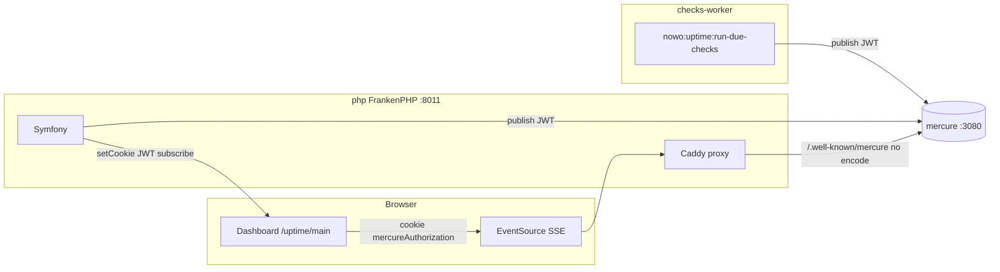

# Mercure in the demos (Symfony 7 and 8)

The demos use **`dashboard.sync: mercure`**: the dashboard receives checks in real time over **SSE** (Server-Sent Events), not via continuous API polling.

## URLs

| Demo | Dashboard | Hub in browser (same origin) | Direct hub (debug only) |
|------|-----------|--------------------------------------|---------------------------|
| Symfony 8 | http://localhost:8011/uptime/main | http://localhost:8011/.well-known/mercure | http://localhost:3080/.well-known/mercure |
| Symfony 7 | http://localhost:8010/uptime/main | http://localhost:8010/.well-known/mercure | http://localhost:3081/.well-known/mercure |

The browser **must always** use the hub on the **same port as the app** (`8011` / `8010`). This sends the JWT subscription cookie. If `MERCURE_PUBLIC_URL` points only to port `3080`/`3081`, Mercure does not receive the cookie and you will only see manual refreshes or polling fallback.

## Docker architecture


```mermaid
flowchart LR
  subgraph browser [Browser]
    D[Dashboard /uptime/main]
    ES[EventSource SSE]
  end
  subgraph php_container [php FrankenPHP :8011]
    Caddy[Caddy proxy]
    SF[Symfony]
  end
  subgraph worker [checks-worker]
    Run[nowo:uptime:run-due-checks]
  end
  Hub[(mercure :3080)]

  D -->|cookie mercureAuthorization| ES
  ES --> Caddy
  Caddy -->|/.well-known/mercure no encode| Hub
  SF -->|setCookie JWT subscribe| D
  Run -->|publish JWT| Hub
  SF -->|publish JWT| Hub
```

| Service | Role |
|----------|-----|
| **php** | Web app, SSE proxy to `mercure`, JWT cookie when loading the dashboard |
| **checks-worker** | Loop every 15 s: runs checks and **publishes** to Mercure (internal `MERCURE_URL`) |
| **mercure** | SSE hub; validates publisher and subscriber JWT |

## Environment variables

In `demo/symfony8/.env` (or `.env.example`):

```env
MERCURE_URL=http://mercure/.well-known/mercure
MERCURE_PUBLIC_URL=http://localhost:8011/.well-known/mercure
MERCURE_JWT_SECRET=!ChangeThisMercureHubJWTSecretKey!
```

| Variable | Usage |
|----------|-----|
| `MERCURE_URL` | Symfony and the worker **publish** here (Docker network, hostname `mercure`) |
| `MERCURE_PUBLIC_URL` | URL seen by the **browser** (FrankenPHP proxy, same origin as the app) |
| `MERCURE_JWT_SECRET` | Shared key hub + `config/packages/mercure.yaml` |

Symfony 7: same variables with `PORT=8010` and public hub `http://localhost:8010/.well-known/mercure`.

## Symfony configuration

`config/packages/nowo_uptime_monitor.yaml`:

```yaml
dashboard:
    sync: mercure
    poll_interval_ms: 30000   # only if Mercure fails in the browser
    mercure:
        topic_template: '/uptime/{tenant}'
        private: true
```

`config/packages/mercure.yaml`:

```yaml
mercure:
    hubs:
        default:
            url: '%env(MERCURE_URL)%'
            public_url: '%env(MERCURE_PUBLIC_URL)%'
            jwt:
                secret: '%env(MERCURE_JWT_SECRET)%'
                publish: ['*']
                subscribe: ['*']
```

## Security (JWT, no API key)

No API keys are needed in the front end. The flow follows the standard **Symfony Mercure Bundle**:

1. **Publish** (backend): the worker and Symfony use `MERCURE_URL` + JWT (`publish`).
2. **Private updates**: `mercure.private: true` in the bundle.
3. **Subscribe** (browser): when opening `/uptime/main`, Symfony calls `Authorization::setCookie()` with the tenant topic (e.g. `/uptime/main`).
4. **EventSource** with `withCredentials: true` sends the cookie to the hub (via proxy on `:8011`).

In production: change `MERCURE_JWT_SECRET`, use HTTPS, and restrict `publish` / `subscribe` in `mercure.yaml` (avoid `*`).

## FrankenPHP proxy (required in demo)

`docker/frankenphp/Caddyfile.dev` routes `/.well-known/mercure` to the `mercure` container **without** `encode` compression (otherwise SSE breaks with `ERR_INCOMPLETE_CHUNKED_ENCODING`):

```caddyfile
@mercure path /.well-known/mercure*
handle @mercure {
    reverse_proxy mercure:80 {
        flush_interval -1
        transport http {
            read_timeout 0
            write_timeout 0
        }
    }
}
```

After changing the Caddyfile:

```bash
docker compose restart php
```

## Browser behavior

| Element | What it indicates |
|----------|------------|
| Badge **Mercure · connected** (green) | SSE open |
| Badge **Mercure · connecting…** | Connecting |
| Badge **Polling · 30s** | Fallback: Mercure unavailable |
| Console `📦 [uptime] script loaded…` | Dashboard assets loaded |
| Console `ℹ️ [uptime] Mercure connected.` | SSE OK (same style as twig-inspector) |
| Network → **EventSource** | `/.well-known/mercure?topic=/uptime/main` on `:8011` |
| Network → **GET summary** | Only on load (and every 30 s on fallback), not every 15 s when Mercure OK |

After `seed-demo --fresh`, JS receives `dashboard_reset` via Mercure or refreshes the layout via `GET /uptime/main/fragment/layout` without a full F5.

## Useful commands

```bash
# Start stack (includes mercure + worker)
make -C demo up-symfony8

# Recreate monitors and first checks
make -C demo reset-demo-symfony8

# Verify manual publish
docker compose -f demo/symfony8/docker-compose.yml exec php \
  php bin/console nowo:uptime:run-due-checks

# Hub logs
docker compose -f demo/symfony8/docker-compose.yml logs mercure --tail 20

# Restart PHP only (after Caddyfile or .env change)
docker compose -f demo/symfony8/docker-compose.yml restart php

# Worker must run the check loop (not FrankenPHP)
docker compose -f demo/symfony8/docker-compose.yml exec checks-worker ps aux
# → should show: sh -c while true; do php bin/console nowo:uptime:run-due-checks ...
```

## checks-worker

The `checks-worker` service uses `entrypoint: []` so it does not start FrankenPHP and instead runs the loop:

```yaml
command:
  - sh
  - -c
  - |
    while true; do
      php bin/console nowo:uptime:run-due-checks --no-ansi 2>&1 || true
      sleep 15
    done
```

Without this there are no new checks or Mercure publications.

## Troubleshooting

| Symptom | Likely cause | Action |
|---------|----------------|--------|
| `ERR_INCOMPLETE_CHUNKED_ENCODING` on `/.well-known/mercure` | Caddy `encode` compresses SSE | Use current `Caddyfile.dev`; `docker compose restart php` |
| Only requests to `/api/.../summary` | Hub on `:3080` or cookie not sent | `MERCURE_PUBLIC_URL=http://localhost:8011/.well-known/mercure` |
| Badge **Polling · 30s** | Mercure closed / invalid JWT | Reopen dashboard; check `mercureAuthorization` cookie |
| Monitors not updating | Worker not running | `docker compose up -d checks-worker --force-recreate` |
| Monitor list after seed without F5 | Normal if Mercure down; with SSE OK `dashboard_reset` arrives | `nowo:uptime:seed-demo --fresh`; wait or reload once |

## More documentation

- [../docs/MERCURE.md](../docs/MERCURE.md) — host application integration
- [README.md](README.md) — demo quick start
